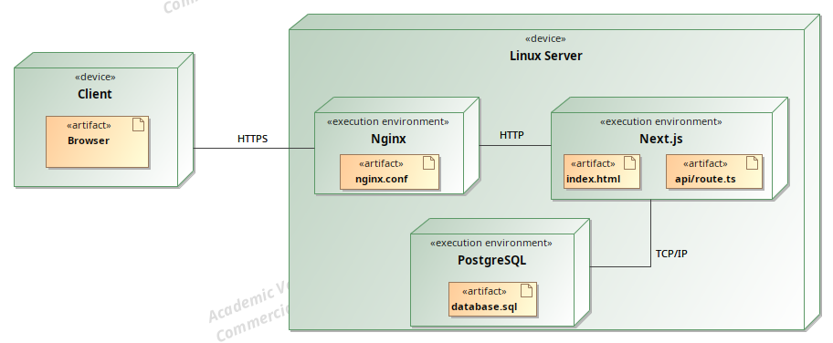

# TestNest

# Sprendžiamo uždavinio aprašymas

## Sistemos paskirtis

Projekto tikslas - sukurti internetinę platformą, skirtą testų kūrimui, atlikimui bei repeticiniam mokymuisi (angl. _Spaced repetition_). Sistema turėtų padėti besimokantiesiems lengviau įsisavinti žinias, o dėstytojams ar instruktoriams – paprasčiau parengti klausimų rinkinius.

Norint peržiūrėti ar atlikti testus registracijos nereikalaus.
Naudotojas, norėdamas kurti testus, prisiregistruos prie platformos. Tą padaręs galės sukurti temą (rinkinį klausimų), klausimas galės turėti vieno, kelių pasirinkų, taip/ne ir atvirojo tipo atsakymus. Klausimai gali būti perpanaudojami ir įkeliami į kitas temas. Tema gali būti privati arba vieša, prie kurios galės prieiti neregistruoti naudotojai. Veiks testų paieška. Atlikus testą galima peržiūrėti atsakymus ir kiek atsakyta teisingai (surinkta taškų).

## Funkciniai reikalavimai

Svečias galės:

- Naršyti ir peržiūrėti viešus testus;
- Atlikti testus;
- Peržiūrėti testo atsakymus;
- Prisijungti / registruotis platformoje.

Registruotas naudotojas galės:

- Viską ką gali svečias;
- Kurti naujus testus;
- Peržiūrėti ir valdyti savo privačius testus;
- Sekti testų atlikimo istoriją, progresą, surinktą taškų skaičių;
- Pridėti esamus klausimus į savo testus;
- Šalinti, redaguoti testus.

Administratorius galės:

- Viską ką gali registruotas naudotojas;
- Peržiūrėti, redaguoti ar pašalinti visus naudotojų sukurtus testus;
- Valdyti naudotojų paskyras (užblokuoti, pašalinti).

# Sistemos architektūra

Sistema bus sukurta pasitelkiant **Next.js**, kuris tarnaus kaip klientinė ir serverinė pusė.

Serverio pusėje:

- **Linux serveris** – pagrindinė vykdymo aplinka.
- **Nginx** – kaip atvirkštinis tarpininkas (angl. _Reverse proxy_), skirtas užklausų nukreipimui, kadangi serveryje veikia keli subdomenai.
- **JWT autentifikacija** – naudotojų prisijungimui ir sesijų valdymui.
- **PostgreSQL** – reliacinė duomenų bazė, skirta testams, klausimams, atsakymams ir naudotojų duomenims saugoti.
- **Drizzle ORM** - mikro ORM SQL operacijoms palengvinti

Žemiau pateikta sistemos diegimo diagrama. Sistema bus patalpinta Oracle Cloud serveryje. Aplikacija pasiekiama per HTTPS protokolą.

# Naudotojo sąsaja

## Pagrindinis puslapis

## Prisijungimas

## Naudotojo valdymo skydas

## Temos klausimų valdymas

## Naujo klausimo pridėjimo modalas

## Esamo klausimo pridėjimas prie temos

## Testo pradėjimas

## Testo atlikimas

## Testo rezultatai

## Administratoriaus valdymo skydas

# API specifikacija

Prieinama [čia](/public/openapi.json) (openapi.json). Patogesnei peržiūrai (su pavyzdžiais): https://testnest.dov.lt/api-docs

# Išvados

Pavyko pasiekti užsibrėžtus tikslus ir įgyvendinti testų atlikimo platformą:

- Suprojektuota duombazė, API sąsaja;
- Sukurta svetainė naudojant Next.js;
- Veikia visi numatyti funkcionalumai skirtingoms rolėms;
- Svetainė paleista debesyse ir prieinama naudotojams.
